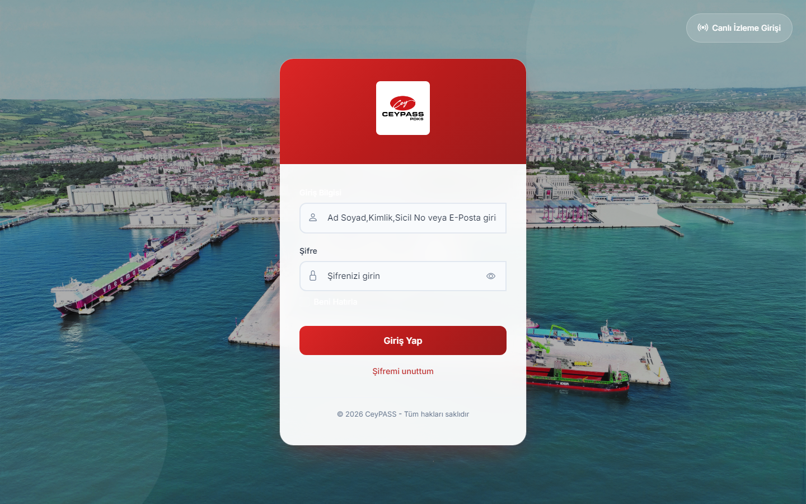
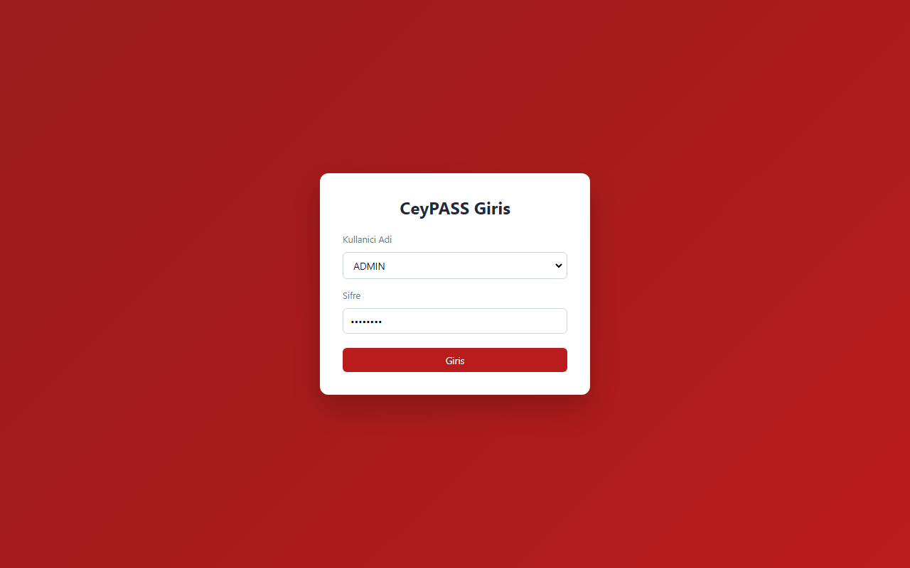
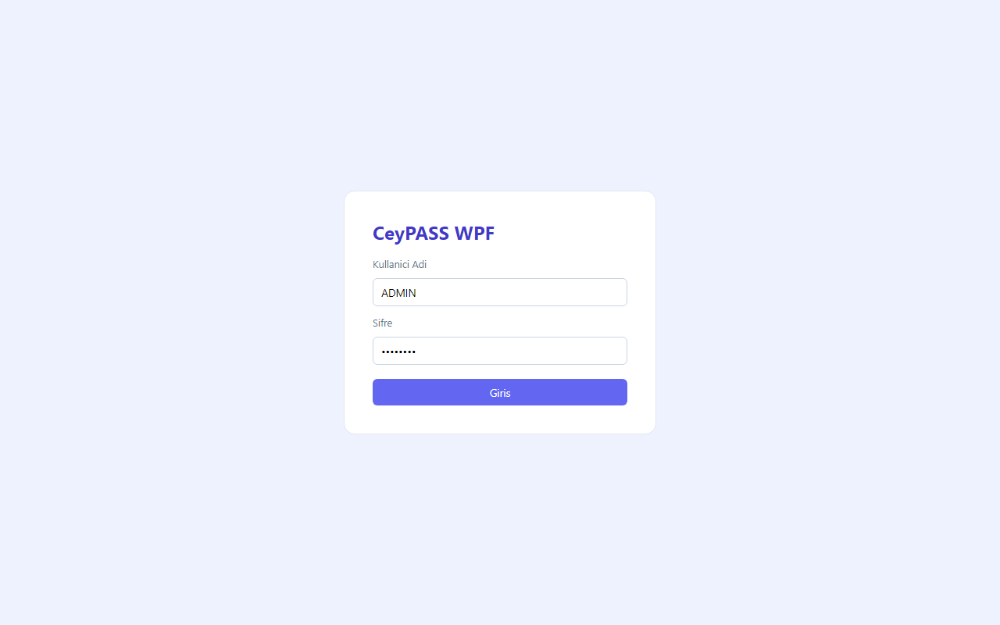
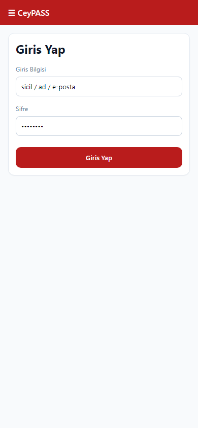

# 1. Giriş ve hesap

[← Ana içindekiler](../Kullanici-Kilavuzu.md)

---

## 1.1 Web — oturum açma

1. Tarayıcıda kurumunuzun verdiği **CeyPASS web adresini** açın.
2. **Kullanıcı adı** alanına sistem yöneticinizin tanımladığı kullanıcı adını yazın.
3. **Şifre** alanına şifrenizi girin.
4. **Giriş** düğmesine tıklayın (veya Enter).
5. Başarılı girişte sol menülü ana uygulama açılır.
6. Hatalı bilgide kırmızı uyarı görürsünüz; birkaç denemeden sonra hesap kilitlenebilir — yöneticinize başvurun.

### Şifremi unuttum (Web)

1. Giriş sayfasında **Şifremi unuttum** bağlantısına tıklayın.
2. E-posta adresinizi girin (sistemde tanımlı olmalı).
3. Gelen bağlantı ile yeni şifre belirleyin.

### Şifre değiştirme (Web)

1. Sağ üstte kullanıcı menüsünü açın.
2. **Şifre değiştir** seçeneğini kullanın.
3. Mevcut ve yeni şifreyi girip kaydedin.

### Çıkış (Web)

1. Sağ üst kullanıcı menüsü → **Çıkış**.

---

## 1.2 WFA — oturum açma

1. Masaüstündeki **CeyPASS (WFA)** kısayolunu çalıştırın.
2. **Kullanıcı adı** ve **Şifre** girin.
3. **Giriş** düğmesine tıklayın veya **Enter** tuşuna basın.
4. Güncelleme uyarısı çıkarsa **Atla** ile devam edebilirsiniz (BT politikasına göre güncelleyin).
5. Ana pencere sol menü ile açılır.

### Çıkış (WFA)

1. Menü → **Çıkış** veya pencereyi kapatın (oturum sonlanır).

---

## 1.3 WPF — oturum açma

1. **CeyPASS WPF** uygulamasını başlatın.
2. Kullanıcı adı / şifre girin → **Giriş**.
3. Sol menülü ana pencere açılır.
4. Bağlantı hatası alırsanız BT biriminden sunucu ayarlarını kontrol ettirin.

### Çıkış (WPF)

1. Sağ üst veya menüden **Çıkış**.

---

## 1.4 Mobile — oturum açma

1. CeyPASS mobil uygulamasını açın.
2. **Giriş bilgisi** alanına ad soyad, TC kimlik no, sicil no veya e-posta yazın (kurumunuz hangisini kabul ediyorsa).
3. **Şifre** girin.
4. İsteğe bağlı **Beni hatırla** işaretleyin (kişisel cihazda).
5. **Giriş Yap** düğmesine dokunun.

### Canlı izleme girişi (Mobile)

1. Giriş ekranı sağ üstte **Canlı İzleme Girişi** (ayrı yetki gerekir).
2. Turnike/canlı geçiş moduna geçilir — bkz. [Canlı izleme](13-canli-izleme.md).

### Çıkış (Mobile)

1. Yan menü → **Çıkış** veya profil alanından oturumu kapatın.

---

## 1.5 Oturum açamıyorum — kontrol listesi

| Kontrol | Açıklama |
|---------|----------|
| Kullanıcı adı / şifre | Büyük-küçük harf, Türkçe karakter |
| Hesap durumu | Pasif veya işten çıkmış personel hesabı |
| Web | Doğru URL, tarayıcı önbelleği |
| WFA/WPF | Doğru kurulum klasörü, güncelleme |
| Mobile | İnternet/VPN, doğru sunucu adresi (BT) |

---

**Önceki:** [0. Önce bunları okuyun ←](00-once-bunlari-okuyun.md)  
**Sonraki:** [2. Ana sayfa ve menüler →](02-dashboard-ve-menuler.md)
