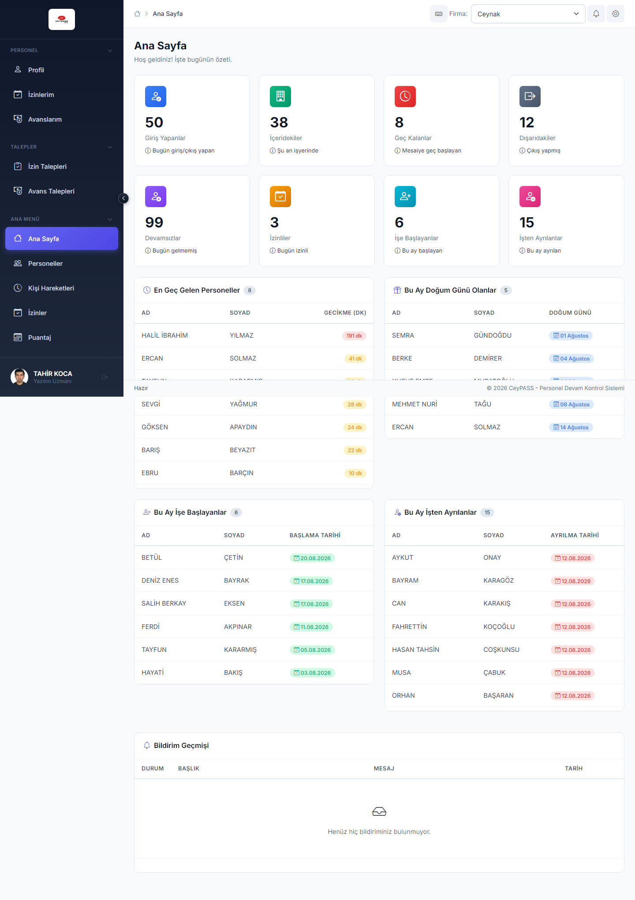
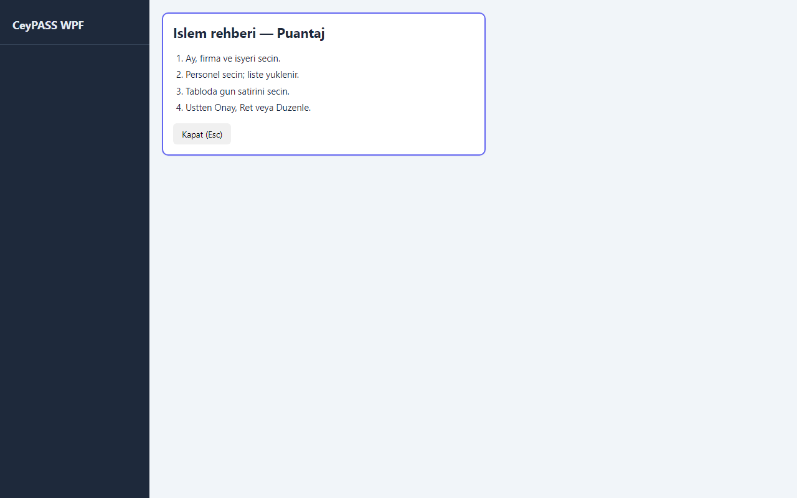
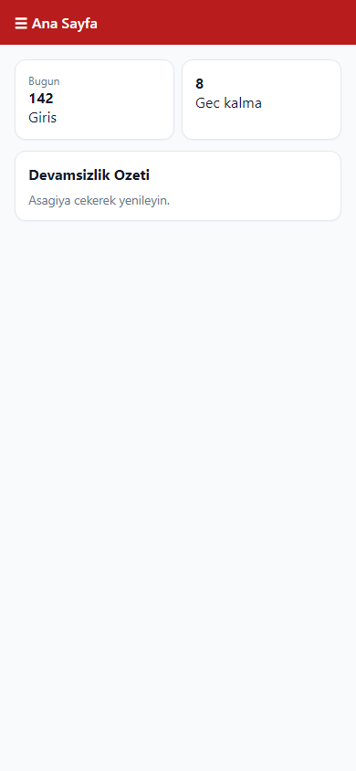

# 2. Ana sayfa ve menüler

[← Ana içindekiler](../Kullanici-Kilavuzu.md)

---

## 2.1 Web — Ana Sayfa (Dashboard)

1. Sol menü → **Ana Menü** grubu → **Ana Sayfa**.
2. Üstte veya yan alanda **Firma** seçimi varsa aktif firmayı seçin.
3. Özet **kartlar** görünür (devamsızlık, geç kalma, izin vb. — kuruma göre değişir).
4. Bir karta tıklayınca ilgili **rapor** veya detay ekranına gidersiniz.
5. Sol menüdeki diğer modüllere buradan geçiş yapabilirsiniz.

---

## 2.2 WFA / WPF — Ana Sayfa

1. Sol menü → **Ana Sayfa**.
2. Web'e benzer özet kartları görürsünüz.
3. **WPF**'de bazı sayfalarda **❓ İşlem rehberi** vardır (Puantaj gibi).

---

## 2.3 Mobile — Ana Sayfa

1. Sol üst **menü (☰)** → **Ana Sayfa**.
2. Özet kartlarını görüntüleyin.
3. Listeyi **aşağı çekerek** yenileyin.
4. Yalnızca personel yetkisi olan bazı kullanıcılar doğrudan **Profil** ekranına yönlendirilir.

---

## 2.4 Web — menü grupları

Sol menü **akordeon grupları** halindedir. Yetkinize göre görünür:

| Grup | Modüller |
|------|----------|
| **Personel** | Profil, İzinlerim, Avanslarım, Yetkili Paneli *(sicil + yetki varsa)* |
| **Ana Menü** | Ana Sayfa, Personeller, Kişi Hareketleri, İzinler, Puantaj, Raporlar |
| **Organizasyon / Tanımlamalar** | Firmalar, İşyerleri, Departmanlar, Pozisyonlar |
| **Ayarlar** | Vardiyalar, Çalışma Statüleri, Cihazlar, Resmi Tatiller |
| **Talepler** | İzin Talepleri, Avans Talepleri |

Menü öğesinin üzerine gelince **tooltip** kısa açıklama gösterir.

---

## 2.5 WFA / WPF — menü grupları

| Grup | Modüller |
|------|----------|
| **Ana Sayfa** | Dashboard |
| **Personel Yönetimi** | Personel Tanımlama, İzinler |
| **Ekstra İşlemler** | Kişi Hareketleri, **Aylık Puantaj**, Raporlar |
| **Tanımlamalar** | Firma, İşyeri, Departman, Pozisyon, Vardiya, Çalışma Statüsü, Cihaz, Resmi Tatil *(grup adları sürüme göre küçük fark gösterebilir)* |

> **Not:** Web'deki «Ana Menü → Puantaj», WFA/WPF'de «Ekstra İşlemler → Aylık Puantaj»dır.

---

## 2.6 Mobile — menü grupları

Yan menü (**☰**) açıldığında:

| Grup | Modüller |
|------|----------|
| **Ana Menü** | Ana Sayfa, Personeller, Kişi Hareketleri, İzinler, Puantaj, Raporlar, tanım ekranları… |
| **Personel** | Profil, İzinlerim, Avanslarım, Yetkili Paneli, QR Giriş |
| **Talepler** | İzin Talepleri, Avans Talepleri |
| **Diğer** | Hakkında, **İpuçları**, **Bildirimler** |

---

## 2.7 Üst başlık (Web / WPF / WFA)

| Öğe | İşlev |
|-----|--------|
| ⌨️ Klavye simgesi | Kısayol listesi (F1 / Ctrl+/ da açar) |
| Kullanıcı adı | Profil, şifre, çıkış |
| Bildirimler | Varsa talep/onay bildirimleri |

---

**Önceki:** [1. Giriş ←](01-giris.md)  
**Sonraki:** [3. Personel yönetimi →](03-personel.md)
