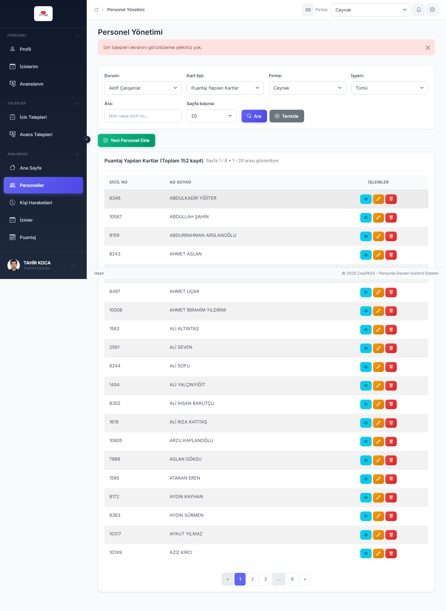
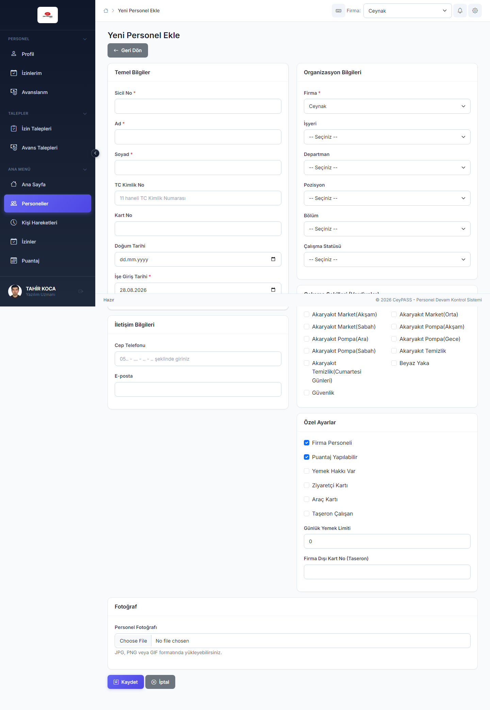
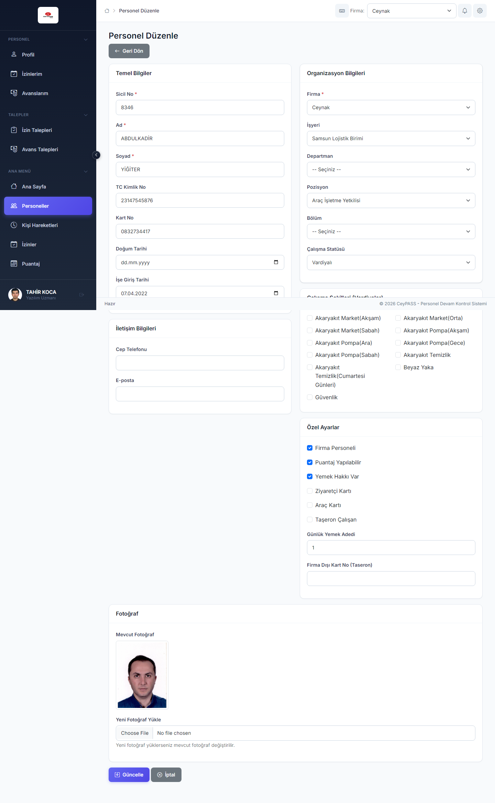
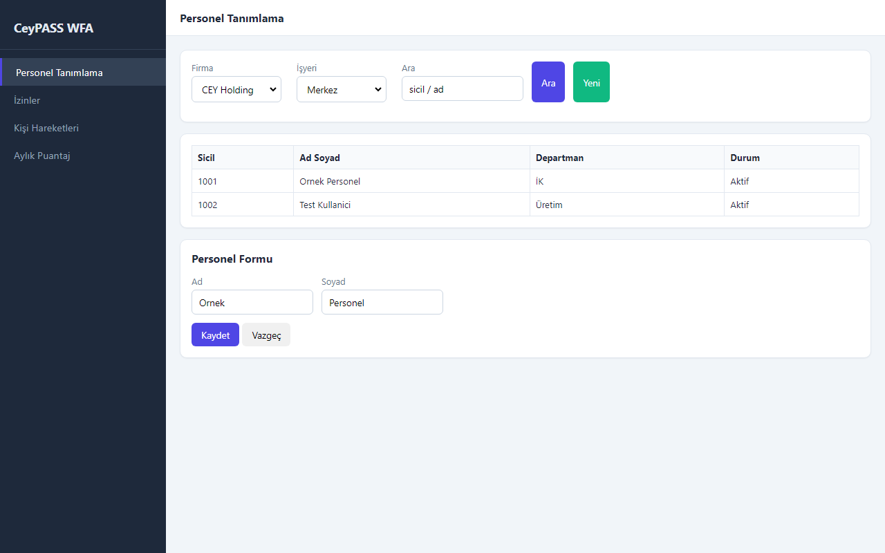
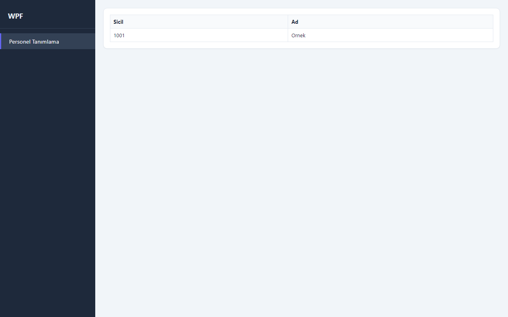
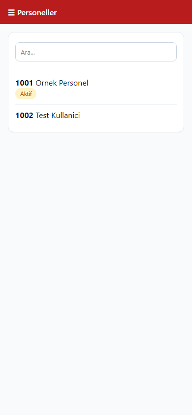
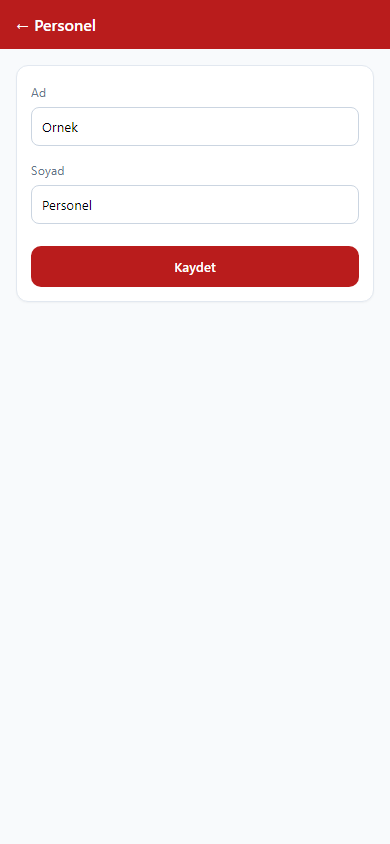

# 3. Personel yönetimi

[← Ana içindekiler](../Kullanici-Kilavuzu.md)

Personel kartı açma, güncelleme, işten çıkış ve listeleme işlemleri.

---

## 3.1 Web — personel listesi

**Menü:** Ana Menü → **Personeller**

### Filtreleme

1. **Durum:** `Aktif Çalışanlar` veya `İşten Çıkanlar`.
2. **Kart tipi:** `Puantaj Yapılan Kartlar` / `Puantaj Yapılmayan Kartlar` *(işten çıkanlarda kart tipi devre dışı)*.
3. **Firma:** *(yalnızca çok firmalı yapı)* firma seçin.
4. **İşyeri:** `Tümü` veya belirli işyeri.
5. **Ara:** İsim veya sicil no yazın.
6. **Sayfa başına:** 10 / 20 / 50 / 100 kayıt.
7. **Filtrele** veya Enter ile listeyi yenileyin.

### Yeni personel ekleme

1. Sağ üst **Yeni Personel** *(yetki: Ekle)*.
2. Açılan **ayrı sayfadaki** formu doldurun:

3. Zorunlu alanları (* işaretli) tamamlayın: kimlik, sicil, firma, işyeri, departman, pozisyon, vardiya vb.
4. **Fotoğraf** yükleyebilirsiniz (varsa alan).
5. **Kaydet** → liste ekranına dönersiniz.

### Personel düzenleme

1. Tabloda ilgili satırda **Düzenle** (kalem simgesi).
2. Form sayfasında bilgileri güncelleyin.
3. **Kaydet**.

### Personel detay / kart ataması

- Puantajlı / puantajsız kart ayrımı form ve kart tipi filtreleri ile yönetilir.
- Puantajsız kartlar ayrı listede **Kart tipi** filtresi ile görülür.

### İşten çıkış

1. Personeli **Düzenle** ile açın veya satır aksiyonundan **İşten Çıkış**.
2. Çıkış tarihi ve gerekirse açıklama girin.
3. Onaylayın.

4. Sağ üst **yeşil bildirim**de **↩ Geri al** (~7 sn) görünür; yanlışlıkla çıkış yaptıysanız hemen kullanın.

### Sayfalama

- Tablo altında sayfa numaraları; **Önceki / Sonraki** ile gezin.

---

## 3.2 WFA — Personel Tanımlama

**Menü:** Personel Yönetimi → **Personel Tanımlama**

### Listeleme

1. Üst filtrelerden firma, işyeri, durum seçin.
2. Liste otomatik veya **Ara** ile yenilenir.

### Yeni / düzenle (aynı ekran)

1. **Yeni** → alt/yan **form paneli** açılır.
2. Alanları doldurun → **Kaydet**.
3. **Vazgeç** formu kapatır, kaydetmez.
4. Satır seçip **Düzenle** → aynı formda mevcut kayıt açılır.

### İşten çıkış

1. Personeli seçin → **İşten Çıkış** (veya form üzerinden).
2. Onaylayın.
3. Alt **durum çubuğunda Geri al** bağlantısı belirir.

---

## 3.3 WPF — Personel Tanımlama

WFA ile aynı mantık; arayüz WPF stillidir.

1. Menü: Personel Yönetimi → **Personel Tanımlama**.
2. Liste + form **tek pencerede**.
3. **Kaydet / Vazgeç** WFA ile aynı.
4. İşten çıkış sonrası **sağ üst toast** içinde **Geri al**.

---

## 3.4 Mobile — Personeller

**Menü:** Ana Menü → **Personeller**

### Listeleme

1. Üst **filtre** simgesine dokunun.
2. Firma, durum, kart tipi, işyeri seçin.
3. **Ara** alanına isim/sicil yazıp listeyi yenileyin.

### Yeni personel

1. **+** veya **Yeni Personel** *(yetki varsa)*.
2. **Tam ekran form** (modal) açılır.

3. Alanları doldurup **Kaydet**.
4. **İptal** veya geri ile form kapanır.

### Düzenleme

1. Listede personele dokunun.
2. Form açılır → değişiklik → **Kaydet**.

### İşten çıkış

1. Personel formunda veya detay menüsünde **İşten Çıkış**.
2. Onaylayın.
3. Başarı popup'ında **Geri al**.

---

## 3.5 Sık sorulanlar — personel

| Soru | Cevap |
|------|--------|
| İşten çıkanı tekrar aktif edebilir miyim? | Evet — çıkıştan sonra **Geri al** veya yetkiniz varsa düzenleme ile (politika kuruma göre). |
| Puantajsız kart nedir? | Puantaj işlenmeyen personel kartları; filtrede ayrı listelenir. |
| Excel alabilir miyim? | Personel listesinde yetkiniz varsa dışa aktarma seçeneği görünür (Web DataTables / platforma göre). |

---

**Önceki:** [2. Ana sayfa ve menüler ←](02-dashboard-ve-menuler.md)  
**Sonraki:** [4. İzinler →](04-izinler.md)
