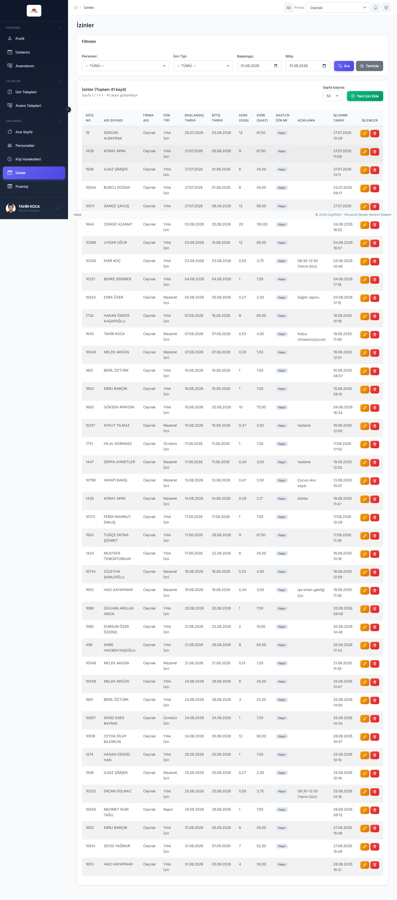
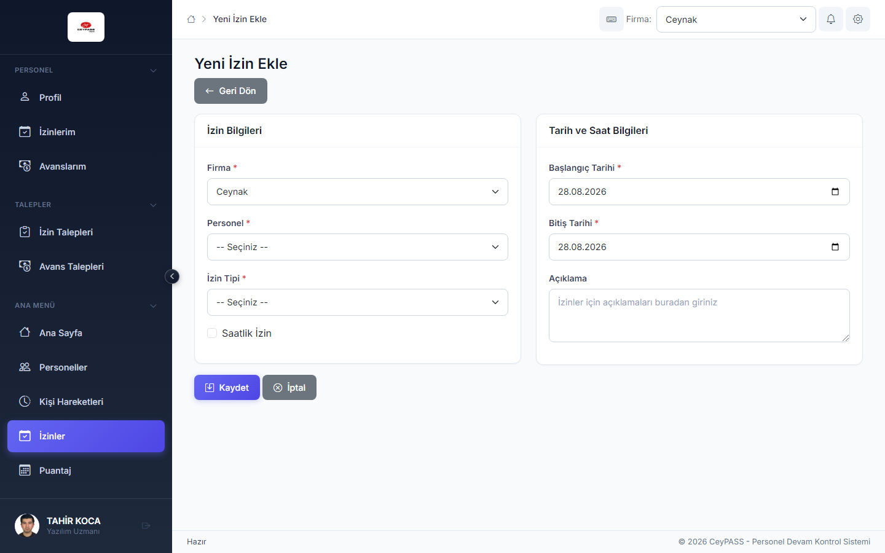
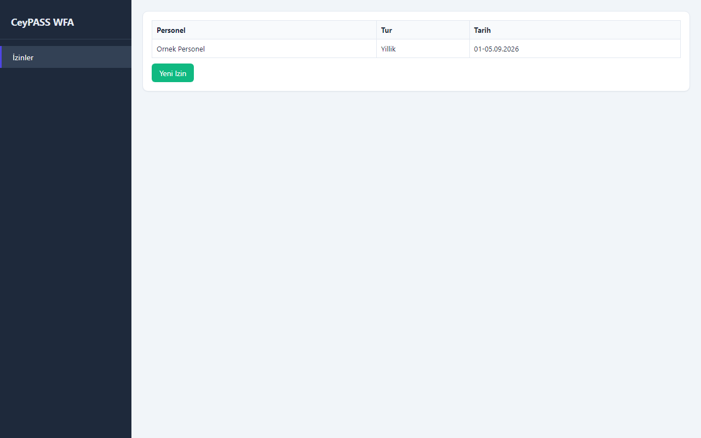
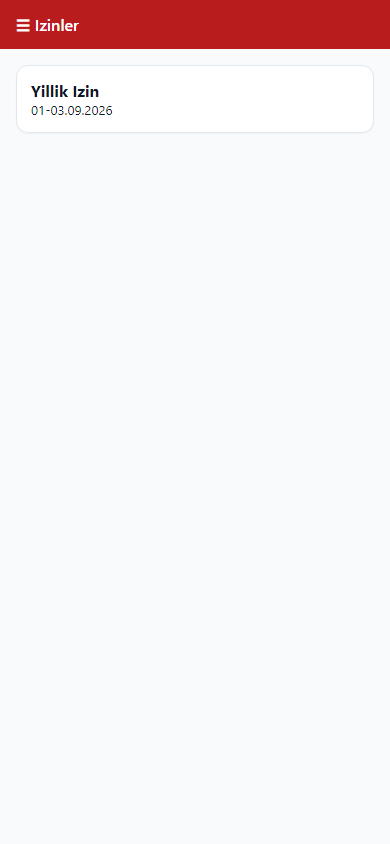

# 4. İzinler (kurumsal kayıtlar)

[← Ana içindekiler](../Kullanici-Kilavuzu.md)

İK veya puantaj biriminin **personel adına** sisteme izin girmesi / düzenlemesi. Personelin kendi talebi için bkz. [5. İzin ve avans talepleri](05-izin-avans-talepleri.md).

---

## 4.1 Web — İzinler

**Menü:** Ana Menü → **İzinler**

### Listeleme

1. Tarih aralığı, firma, personel filtrelerini kullanın *(ekranda görünen alanlar)*.
2. **Getir** / filtre uygulayın.
3. Tabloda izin türü, başlangıç-bitiş, gün sayısı, durum görünür.

### Yeni izin

1. **Yeni** veya **İzin Ekle** *(yetki: Ekle)*.
2. **Ayrı sayfa** formu açılır.

3. **Personel** seçin.
4. **İzin türü** (yıllık, mazeret, rapor vb.).
5. **Başlangıç / bitiş tarihi** — gün sayısı otomatik hesaplanabilir.
6. Açıklama (isteğe bağlı).
7. **Kaydet**.

### Düzenleme

1. Satırda **Düzenle**.
2. Formda alanları güncelleyin → **Kaydet**.

### Silme (pasife alma)

1. Satırda **Sil** veya **Pasife Al**.
2. Onay penceresinde **Evet**.
3. Sağ üst bildirimde **↩ Geri al** (~7 sn).

### İzin kağıdı (Web)

1. Yetkiniz varsa satır aksiyonunda **İzin kağıdı** / yazdırma.
2. PDF veya yazdırma önizlemesi açılır.

---

## 4.2 WFA — İzinler

**Menü:** Personel Yönetimi → **İzinler**

1. Üst filtrelerden personel / tarih seçin.
2. Liste grid'de görünür.
3. **Yeni** → alt form paneli açılır; alanları doldur → **Kaydet**.
4. Satır seç → **Düzenle** → formda güncelle → **Kaydet**.
5. **Sil** → onay → alt çubukta **Geri al**.

---

## 4.3 WPF — İzinler

WFA ile aynı akış; pasife alma sonrası **toast Geri al**.

1. Personel Yönetimi → **İzinler**.
2. Liste + form aynı pencerede.

---

## 4.4 Mobile — İzinler

**Menü:** Ana Menü → **İzinler**

1. Kart listesinde izinler görünür.
2. **+** → tam ekran **form modal**.
3. Personel, tür, tarihler → **Kaydet**.
4. Karta dokun → düzenle.
5. Sil → onay → popup **Geri al**.

---

## 4.5 İpuçları

| Konu | Açıklama |
|------|----------|
| Kurumsal izin vs talep | Kurumsal kayıt İK'nın doğrudan girdiği izin; talep personelin başlattığı onay sürecidir |
| Puantaj etkisi | Onaylı izinler puantaj hesaplamasına yansır (kurum kurallarına göre) |
| Çakışan tarih | Sistem uyarı verebilir; tarihleri kontrol edin |

---

**Önceki:** [3. Personel ←](03-personel.md)  
**Sonraki:** [5. İzin ve avans talepleri →](05-izin-avans-talepleri.md)
