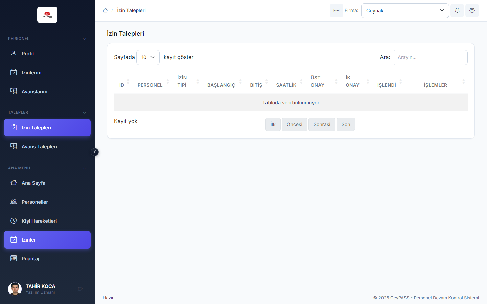

# 5. İzin ve avans talepleri

[← Ana içindekiler](../Kullanici-Kilavuzu.md)

Personelin **kendi adına** talep oluşturduğu ve amir/İK'nın **onayladığı** süreçler.

---

## 5.1 Web — İzin Talepleri (İK / amir)

**Menü:** Talepler → **İzin Talepleri**

### Bekleyen talepleri görme

1. **Durum** filtresi: Bekleyen / Onaylanan / Reddedilen.
2. Tarih ve personel filtreleri.
3. **Getir** ile listeyi yenileyin.

### Talebi onaylama

1. Satırı açın veya **Onayla** düğmesine tıklayın.
2. Gerekirse açıklama ekleyin.
3. Onay sonrası personelin izin kaydı oluşur (kurum akışına göre).

### Talebi reddetme

1. **Reddet** → red sebebi yazın → onayla.
2. Personele bildirim gidebilir.

### Toplu işlem

Yetkiniz varsa birden fazla talebi seçip toplu onay/red (ekranda görünüyorsa).

---

## 5.2 Web — Avans Talepleri

**Menü:** Talepler → **Avans Talepleri**

1. Filtreler → liste.
2. **Onayla / Reddet** — izin talepleri ile benzer akış.
3. Onaylanan avans personel kaydına işlenir.

---

## 5.3 Mobile — İzin / Avans talepleri (İK)

**Menü:** Talepler → **İzin Talepleri** / **Avans Talepleri**

1. Kart listesi.
2. Talebe dokunun → detay.
3. **Onayla** veya **Reddet** + sebep.

---

## 5.4 Personel tarafı — İzinlerim / Avanslarım

Detaylı adımlar: [11. Personel portalı](11-personel-portali.md)

| Platform | Menü |
|----------|------|
| Web | Personel → İzinlerim / Avanslarım |
| Mobile | Personel → İzinlerim / Avanslarım |

### Yeni izin talebi (personel)

1. **İzinlerim** → **Yeni Talep**.
2. İzin türü, tarih aralığı, açıklama.
3. **Gönder** → amir/İK onay kuyruğuna düşer.
4. Durum: Bekliyor → Onaylandı / Reddedildi.

---

## 5.5 WFA / WPF

İzin/avans **talep modülü** ağırlıklı olarak **Web ve Mobile**'dadır. Masaüstünde kurumsal **İzinler** ekranından doğrudan kayıt girilir; talep onayı için Web/Mobile kullanın veya kurumunuzun tanımladığı sürece göre hareket edin.

---

**Önceki:** [4. İzinler ←](04-izinler.md)  
**Sonraki:** [6. Kişi hareketleri →](06-kisi-hareketleri.md)
