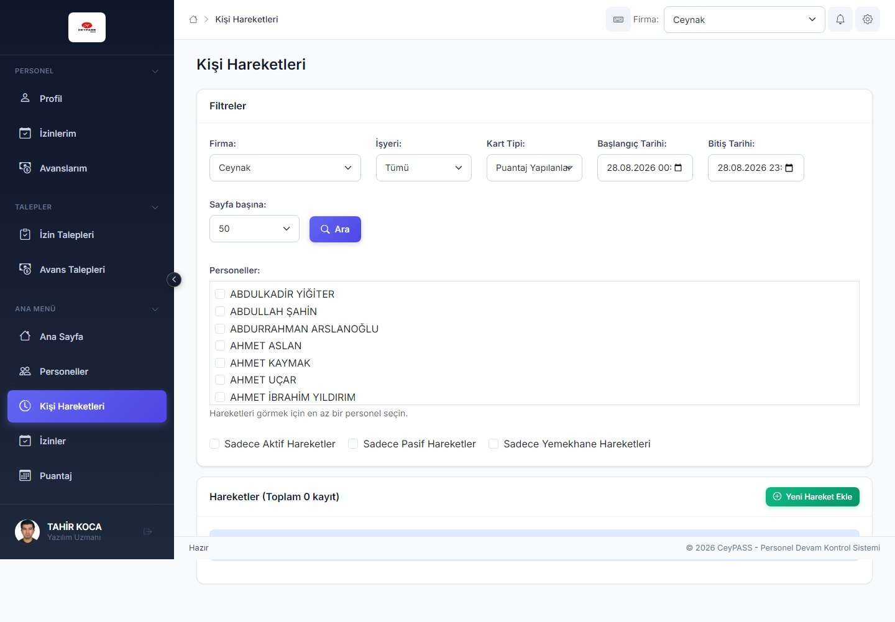
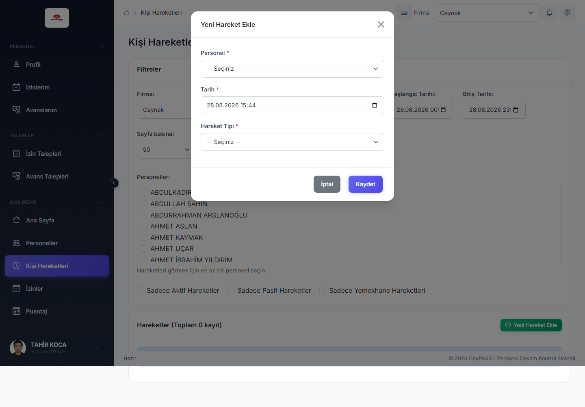
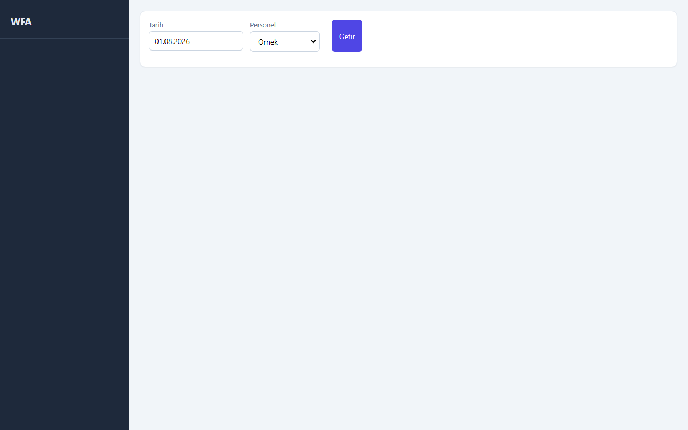
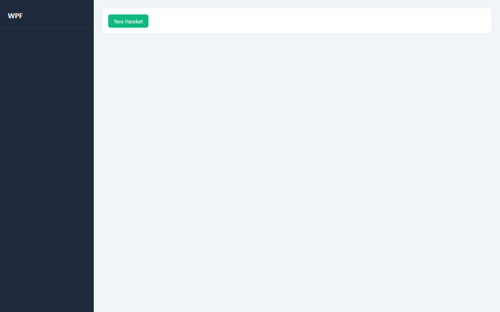
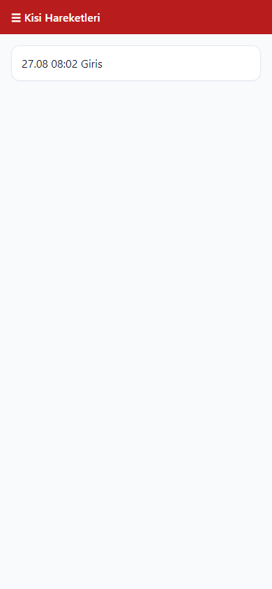

# 6. Kişi hareketleri

[← Ana içindekiler](../Kullanici-Kilavuzu.md)

Turnike/kart okuyucunun kaydetmediği **manuel giriş-çıkış** ve mevcut hareketleri düzenleme.

> ⚠️ Bu ekranda **Excel dışa aktarma yoktur**. Rapor için [8. Raporlar](08-raporlar.md) modülünü kullanın.

---

## 6.1 Web — Kişi Hareketleri

**Menü:** Ana Menü → **Kişi Hareketleri**

### Listeleme

1. **Başlangıç / bitiş tarihi** seçin.
2. **Firma** seçin.
3. **Personel** — tek veya boş (tümü, yetkiye göre).
4. **Getir** / **Ara** ile tabloyu yükleyin.
5. Sütunlar: tarih, saat, yön (giriş/çıkış), cihaz, kaynak vb.

### Yeni hareket ekleme

1. **Yeni Hareket** veya **Ekle** *(yetki: Ekle)*.
2. Modal pencere açılır.

3. **Personel** seçin.
4. **Tarih ve saat** girin.
5. **Hareket tipi** (giriş / çıkış).
6. Gerekirse **cihaz** veya açıklama.
7. **Kaydet** → modal kapanır, liste yenilenir.

### Düzenleme

1. Satırda **Düzenle** (kalem).
2. Modalda alanları güncelleyin → **Kaydet**.

### Pasife alma (silme)

1. Satırda **Sil** / **Pasife Al**.
2. Onaylayın.
3. Toast'ta **↩ Geri al**.

---

## 6.2 WFA — Kişi Hareketleri

**Menü:** Ekstra İşlemler → **Kişi Hareketleri**

1. Tarih, firma, personel filtreleri.
2. **Ekle** → **ayrı pencere** (form).
3. Alanları doldur → **Kaydet**.
4. Satır seç → **Düzenle** → aynı pencere.
5. **Sil** → onay → alt çubuk **Geri al**.
6. Bazı sürümlerde **çoklu personel** seçimi ile toplu filtre mümkündür.

---

## 6.3 WPF — Kişi Hareketleri

**Menü:** Ekstra İşlemler → **Kişi Hareketleri**

WFA ile aynı mantık; ekle/düzenle **dialog penceresi**; pasife alma → **toast Geri al**.

---

## 6.4 Mobile — Kişi Hareketleri

**Menü:** Ana Menü → **Kişi Hareketleri**

1. **Filtre** simgesi → tarih, firma, personel.
2. Liste kart veya satır görünümünde.
3. **+** → hareket ekleme **form modal**.
4. Kayda dokun → düzenle.
5. Sil → onay → popup **Geri al**.

---

## 6.5 Ne zaman kullanılır?

| Durum | Örnek |
|-------|--------|
| Unutulan kart okutma | Personel giriş yaptı ama turnike kaydetmedi |
| Düzeltme | Yanlış saatte okutma |
| Manuel lokasyon | Geçici cihaz dışı giriş |

Manuel hareketler puantaj ve raporlara yansır; yetkisiz kullanım denetim altında tutulmalıdır.

---

**Önceki:** [5. İzin ve avans talepleri ←](05-izin-avans-talepleri.md)  
**Sonraki:** [7. Aylık puantaj →](07-puantaj.md)
