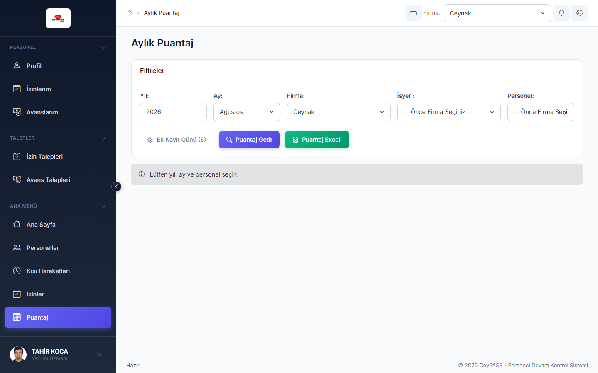
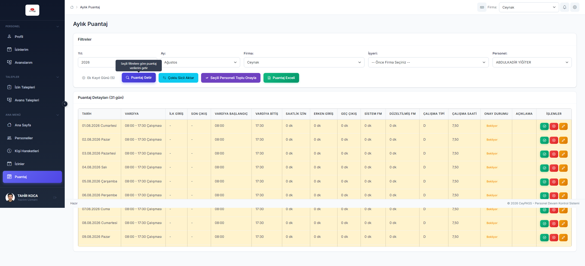
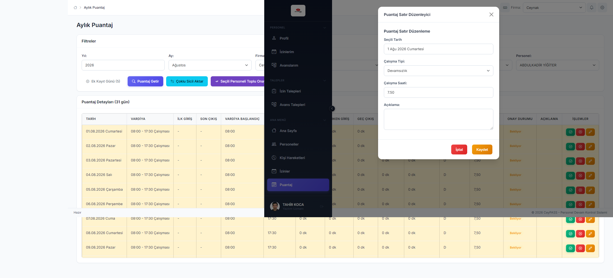
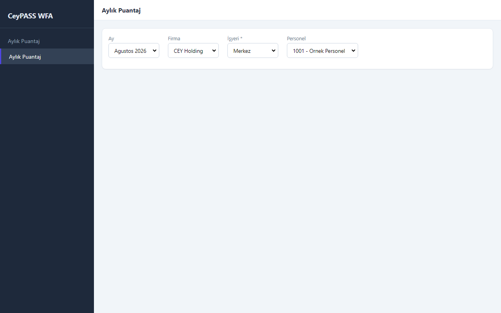
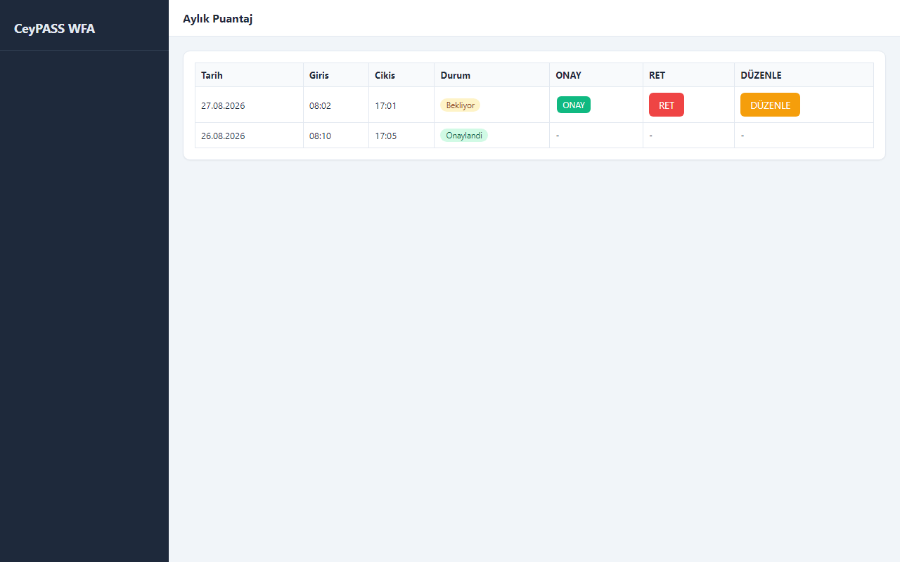
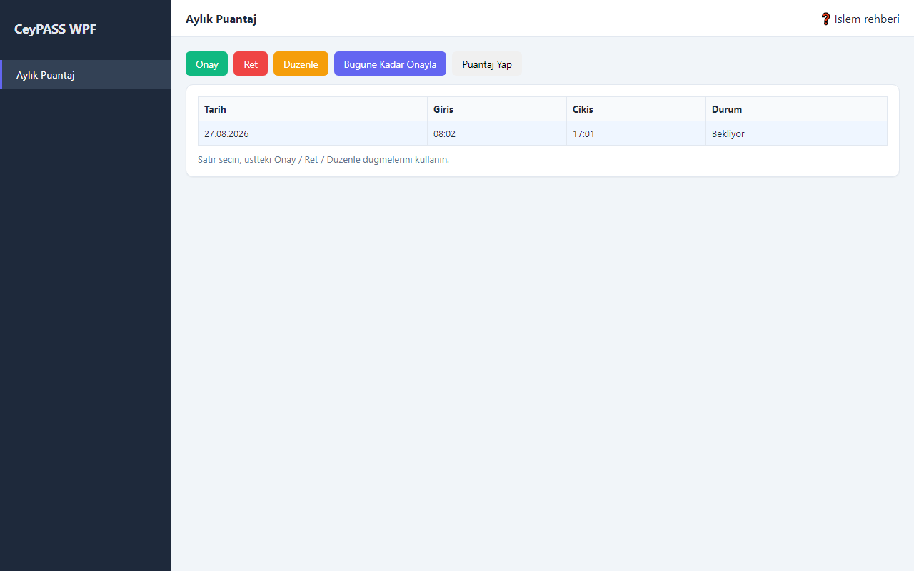
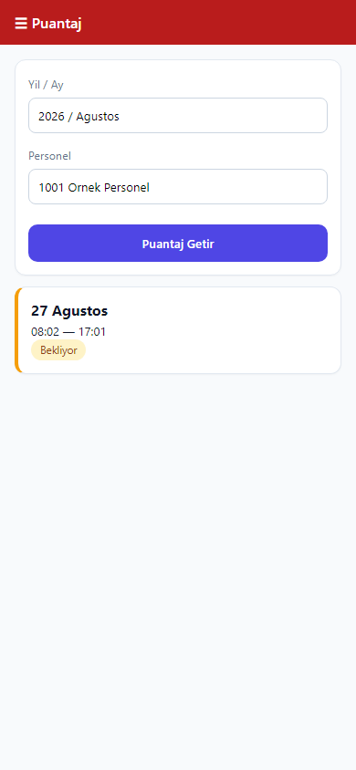
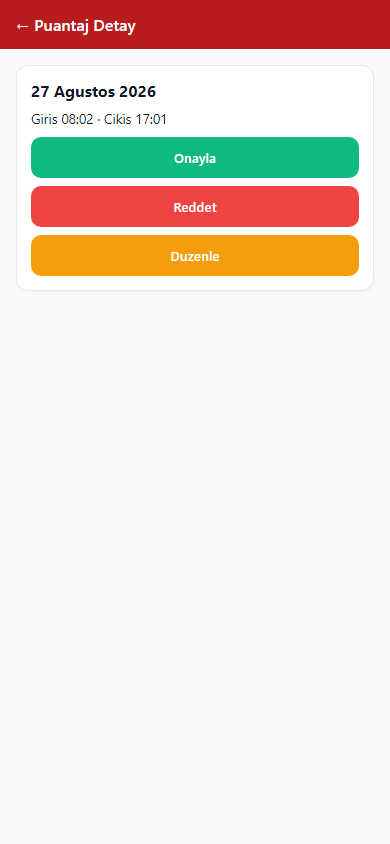

# 7. Aylık puantaj

[← Ana içindekiler](../Kullanici-Kilavuzu.md)

Puantaj, platformlar arasında **en çok fark eden** modüldür. Kendi arayüzünüzün bölümünü okuyun.

---

## 7.0 Ortak kurallar (tüm platformlar)

1. **Personel seçilmeden** günlük liste gelmez.
2. **Bugün ve gelecek günler** kilitlidir (onay/ret/düzenleme yapılamaz).
3. **Bu ayın geçmiş günleri** (yetkiniz varsa) işlenebilir.
4. **Geçen ay** yalnızca tanımlı **Ek Kayıt Günü** süresi içinde düzenlenebilir; süre dolunca gri/kilitli kalır.
5. **Yazdırma yoktur**; Excel dışa aktarım ayrı yetkidir.
6. Durum renkleri: [0. Önce bunları okuyun — renkler](00-once-bunlari-okuyun.md)

---

## 7.1 Web — Aylık Puantaj

**Menü:** Ana Menü → **Puantaj**

### 7.1.1 Listeyi getirme

1. **Yıl** seçin.
2. **Ay** seçin.
3. **Firma** seçin.
4. **İşyeri** — boş bırakılırsa **tüm işyerleri**; daraltmak için işyeri seçin.
5. **Personel** listesinden kişiyi seçin.
6. **Puantaj Getir** düğmesine tıklayın. *(Liste otomatik gelmez.)*

### 7.1.2 Satır işlemleri

Tabloda her gün bir satırdır. Kilitli satırlarda butonlar pasiftir.

| İşlem | Adımlar |
|--------|---------|
| **Onay** | Sarı «Bekliyor» satırda yeşil **✓** → **ek pencere açılmaz**, doğrudan onaylanır |
| **Ret** | Kırmızı **✗** → **Red sebebi** penceresi açılır → sebep yazın → onayla |
| **Düzenle** | Sarı **kalem** → **Satır düzenleme** penceresi |

Düzenleme penceresinde giriş/çıkış saatleri, puantaj tipi, açıklama alanlarını güncelleyip kaydedin.

### 7.1.3 Toplu işlemler

| Düğme | Ne yapar? |
|-------|-----------|
| **Seçili Personeli Toplu Onayla** | Seçili personelin **o ayın tüm bekleyen** kayıtlarını onaylar |
| **Çoklu Sicil Aktar** | Yetkili rollere özel — başka sicilden puantaj aktarımı |
| **Ek Kayıt Günü** | Geçen ay düzenleme süresi (üst düzey yetki) |

> Web'de **«Bugüne Kadar Onayla» yoktur** (WFA/WPF'de vardır).

### 7.1.4 Excel

1. **Puantaj Exceli** düğmesine tıklayın *(yetki: dışa aktarma)*.
2. Dosya tarayıcı indirme klasörüne iner.

---

## 7.2 WFA — Aylık Puantaj

**Menü:** Ekstra İşlemler → **Aylık Puantaj**

### 7.2.1 Listeyi getirme

1. **Ay** — tek combobox (genelde Ocak 2025'ten bugüne aylar).
2. **Firma** seçin.
3. **İşyeri** — **zorunlu**; seçmeden personel listesi gelmez.
4. **Personel** seçin → günlük tablo **otomatik** yüklenir.

### 7.2.2 Satır işlemleri (grid butonları)

| Kolon | Adımlar |
|-------|---------|
| **ONAY** | Satırdaki ONAY → doğrudan onay |
| **RET** | RET → **red sebebi penceresi** |
| **DÜZENLE** | DÜZENLE → **satır düzenleme penceresi** |

### 7.2.3 Toplu işlemler

| Düğme | Ne yapar? |
|-------|-----------|
| **Bugüne Kadar Onayla** | Bu ay: düne kadar bekleyenler; geçmiş ay: ay sonuna kadar bekleyenler |
| **Çoklu Sicil Aktar** | Yetkili roller |
| **Ek Kayıt Ayarla** | Ek kayıt günü tanımı |

### 7.2.4 Excel

1. **Puantaj Yap** düğmesi.
2. Kayıt konumunu seçin → `.xlsx` dosyası oluşur.

---

## 7.3 WPF — Aylık Puantaj

**Menü:** Ekstra İşlemler → **Aylık Puantaj**

### 7.3.1 İşlem rehberi

1. Sayfadaki **❓** simgesine tıklayın.
2. Adım adım yardım balonu açılır.
3. **✕** veya **Esc** ile kapatın.

### 7.3.2 Filtre

WFA ile aynı: Ay → Firma → **Zorunlu işyeri** → Personel (otomatik yükleme).

### 7.3.3 Onay / ret / düzenle (WFA'dan farklı)

1. Tabloda **tek satır seçin** (tıklayın).
2. Üst araç çubuğunda **Onay**, **Ret** veya **Düzenle** düğmesine basın.
3. **Ret** ve **Düzenle** dialog penceresi açar; **Onay** çoğu zaman doğrudan işlenir.
4. Kilitli satır seçiliyken üst düğmeler **pasif** kalır.

### 7.3.4 Toplu / Excel

WFA ile aynı: **Bugüne Kadar Onayla**, **Puantaj Yap** (Excel).

---

## 7.4 Mobile — Puantaj

**Menü:** Ana Menü → **Puantaj**

### 7.4.1 Listeyi getirme

1. **Yıl** ve **Ay** — seçici pencerelerden.
2. **Firma** seçin.
3. **İşyeri** — «Tümü» mümkün.
4. **Personel** seçin.
5. **Puantaj Getir** — personel seçince liste çoğu zaman otomatik de gelir.

### 7.4.2 Gün işlemleri (kart görünümü)

1. İlgili gün **kartına** dokunun.
2. Alttan **detay paneli** açılır.

3. **Onayla** — onay formu/modal.
4. **Reddet** — red sebebi girin.
5. **Düzenle** — saat/tip düzenleme formu.

### 7.4.3 Toplu işlemler

| Düğme | Ne yapar? |
|-------|-----------|
| **Toplu Onayla** | O ayın tüm bekleyen kayıtları (Web «Toplu Onayla» gibi) |
| **Gelişmiş** | Ek Kayıt Günü, Çoklu Sicil Aktar *(yetki)* |

> Mobile'da **«Bugüne Kadar Onayla» yoktur**.

### 7.4.4 Excel

1. **Excel** düğmesi.
2. Dosya indirilir veya paylaşım menüsü açılır (cihaza göre).

---

## 7.5 Karşılaştırma tablosu

| | Web | WFA | WPF | Mobile |
|---|-----|-----|-----|--------|
| Menü yolu | Ana Menü | Ekstra İşlemler | Ekstra İşlemler | Ana Menü |
| İşyeri | Opsiyonel | **Zorunlu** | **Zorunlu** | Opsiyonel |
| Liste yükleme | Puantaj Getir | Otomatik | Otomatik | Getir + otomatik |
| Onay UI | Satır ✓ | Grid ONAY | Satır + üst Onay | Kart → detay |
| Toplu onay | Tüm ay | Bugüne kadar | Bugüne kadar | Tüm ay |
| Excel düğmesi | Puantaj Exceli | Puantaj Yap | Puantaj Yap | Excel |
| Klavye kısayolu | Var | Var | Var | Yok |

---

## 7.6 Puantaj listesi boş — sorun giderme

| Kontrol | Platform |
|---------|----------|
| Personel seçildi mi? | Hepsi |
| **Puantaj Getir** tıklandı mı? | Web, Mobile |
| **İşyeri** seçildi mi? | WFA, WPF (**zorunlu**) |
| Ay/yıl doğru mu? | Hepsi |
| Personelin puantajlı kartı var mı? | Hepsi |
| Tüm günler kilitli mi (gelecek/bugün)? | Hepsi — normal |

---

**Önceki:** [6. Kişi hareketleri ←](06-kisi-hareketleri.md)  
**Sonraki:** [8. Raporlar →](08-raporlar.md)
