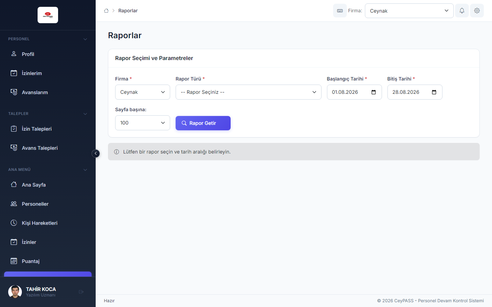

# 8. Raporlar

[← Ana içindekiler](../Kullanici-Kilavuzu.md)

Devamsızlık, geç kalma, puantaj özetleri ve benzeri **liste raporları**.

---

## 8.1 Web — Raporlar

**Menü:** Ana Menü → **Raporlar**

### Rapor alma (genel akış)

1. **Rapor türü** seçin (combobox — kuruma göre: devamsızlık, geç kalma, puantaj özeti, hareket listesi vb.).
2. **Tarih aralığı** belirleyin.
3. **Firma**; gerekirse **işyeri**, **departman**, **personel** filtreleri.
4. **Getir** veya **Raporu Oluştur**.
5. Sonuç **önizleme** tablosunda görünür.
6. Yetkiniz varsa:
   - **Excel** — `.xlsx` indir
   - **PDF** — yazdırılabilir PDF
7. **Ctrl+P** — yazdırma önizlemesi (Web).

### İpuçları

- Geniş tarih aralığı raporu yavaşlatabilir; daraltın.
- Dashboard kartlarından gelen linkler aynı rapor türünü önceden filtreli açabilir.

---

## 8.2 WFA — Raporlar

**Menü:** Ekstra İşlemler → **Raporlar**

1. Sol veya üstte **rapor türü** combobox.
2. Parametre panelinde tarih, firma, işyeri…
3. **Getir** → sağ/altta grid önizleme.
4. **Excel** / **PDF** düğmeleri (yetkiye göre).
5. **Ctrl+P** — yazdır (varsa).

---

## 8.3 WPF — Raporlar

WFA ile aynı adımlar; Ekstra İşlemler → **Raporlar**.

1. Rapor türü seçin.
2. Parametreleri doldurun.
3. **Getir** → önizleme.
4. **Excel** / **PDF** dışa aktarın.

---

## 8.4 Mobile — Raporlar

**Menü:** Ana Menü → **Raporlar**

1. **Rapor tipi** seçin.
2. Filtre alanlarını doldurun.
3. **Önizleme** — kaydırılabilir tablo veya liste.
4. **Excel** / **Paylaş** — cihazın paylaşım menüsü (WhatsApp, e-posta, Dosyalar vb.).

---

## 8.5 Kişi hareketleri Excel'i

Kişi hareketleri **ekranından** Excel alınamaz. Hareket listesi için:

1. **Raporlar** → uygun hareket/devamsızlık raporunu seçin.
2. Tarih ve personel filtrelerini uygulayın.
3. Excel dışa aktarın.

---

**Önceki:** [7. Aylık puantaj ←](07-puantaj.md)  
**Sonraki:** [9. Organizasyon tanımları →](09-organizasyon-tanimlari.md)
