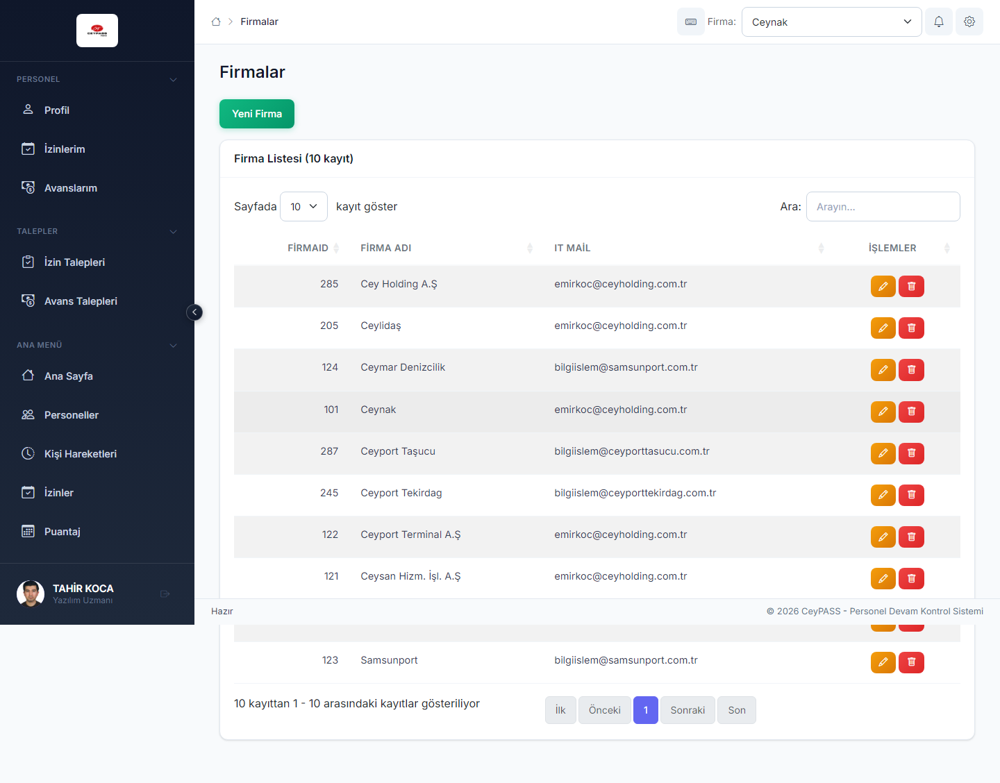

# 9. Organizasyon tanımları

[← Ana içindekiler](../Kullanici-Kilavuzu.md)

Firma, işyeri, departman ve pozisyon **master verileri**. Personel ve puantaj filtreleri bu tanımlara bağlıdır.

---

## 9.1 Web — menü yolu

**Organizasyon / Tanımlamalar** grubu:

| Modül | Menü |
|-------|------|
| Firmalar | Firmalar |
| İşyerleri | İşyerleri |
| Departmanlar | Departmanlar |
| Pozisyonlar | Pozisyonlar |



---

## 9.2 Genel CRUD akışı (tüm platformlar)

Her tanım ekranı benzer işlemleri destekler:

### Listeleme

1. Modül menüsüne girin.
2. Firma filtresi varsa seçin (çok firmalı yapı).
3. Tablo/grid'de kayıtlar listelenir.

### Yeni kayıt

1. **Yeni** / **Ekle**.
2. Form alanlarını doldurun:

| Modül | Tipik alanlar |
|-------|----------------|
| **Firma** | Firma adı, vergi no, adres, aktif |
| **İşyeri** | Bağlı firma, işyeri adı, kod, adres |
| **Departman** | Firma/işyeri, departman adı, üst departman |
| **Pozisyon** | Departman, pozisyon adı, kod |

3. **Kaydet**.

### Düzenleme

1. Satırda **Düzenle**.
2. Alanları güncelle → **Kaydet**.

### Pasife alma

1. **Sil** / **Pasife al** (kalıcı silme yerine pasif yapılabilir).
2. Pasif kayıt yeni personel atamasında listelenmeyebilir.

---

## 9.3 WFA / WPF

Tanım ekranları sol menüde **Tanımlamalar** veya benzer grupta:

1. **Firma Tanımlama**, **İşyeri Tanımlama**, **Departman**, **Pozisyon** vb.
2. Liste + form **aynı pencerede** (WFA/WPF personel ekranı gibi).
3. **Kaydet / Vazgeç**.

### WFA adımları (örnek — Firma)

1. Tanımlamalar → **Firma Tanımlama**.
2. **Yeni** → form paneli açılır.
3. Firma adı ve zorunlu alanları doldurun → **Kaydet**.
4. Satır seç → **Düzenle** ile güncelleyin.

### WPF adımları (örnek — Departman)

1. Tanımlamalar → **Departman Tanımlama**.
2. Firma/işyeri filtresi seçin.
3. **Ekle** → departman adı ve üst departman → **Kaydet**.

---

## 9.4 Mobile

Ana Menü altında **Firmalar**, **İşyerleri**, **Departmanlar**, **Pozisyonlar**:

1. Kart liste.
2. **+** → form modal.
3. Düzenle → karta dokun.
4. **Kaydet** veya **İptal**.

---

## 9.5 Sıralama ve bağımlılık

```
Firma → İşyeri → Departman → Pozisyon → Personel
```

- Yeni **işyeri** eklemeden önce **firma** olmalı.
- Personel formunda departman/pozisyon listeleri seçili firmaya göre filtrelenir.
- Yanlış hiyerarşi puantaj filtrelerinde boş liste oluşturabilir.

---

**Önceki:** [8. Raporlar ←](08-raporlar.md)  
**Sonraki:** [10. Sistem ayarları →](10-sistem-ayarlari.md)
