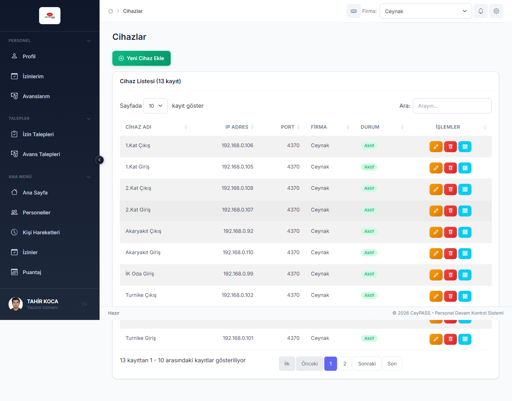

# 10. Sistem ayarları

[← Ana içindekiler](../Kullanici-Kilavuzu.md)

Vardiya, çalışma statüsü, cihaz ve resmi tatil tanımları.

---

## 10.1 Web — menü yolu

**Ayarlar** grubu:

| Modül | Açıklama |
|-------|----------|
| **Vardiyalar** | Mesai başlangıç/bitiş, tolerans, gece vardiyası |
| **Çalışma Statüleri** | Tam zamanlı, yarı zamanlı vb. |
| **Cihazlar** | Turnike, okuyucu IP/kod, lokasyon |
| **Resmi Tatiller** | Takvimde izin/puantaj etkileyen tatil günleri |

---

## 10.2 Vardiyalar

### Web

1. Ayarlar → **Vardiyalar**.
2. **Yeni** → form:
   - Vardiya adı
   - Giriş / çıkış saati
   - Mola süreleri (varsa)
   - Geç kalma / erken çıkış toleransı
3. **Kaydet**.
4. Personel kartına vardiya ataması [Personel](03-personel.md) formundan yapılır.

### WFA / WPF

1. Tanımlamalar → **Vardiya Tanımlama**.
2. Liste + form aynı pencerede.
3. **Yeni** → alanları doldur → **Kaydet**.

### Mobile

1. Ana Menü → **Vardiyalar**.
2. **+** → form modal → **Kaydet**.

---

## 10.3 Çalışma statüleri

### Web

1. Ayarlar → **Çalışma Statüleri**.
2. **Ekle** → ad, kod, aktif → **Kaydet**.
3. Personel formunda **çalışma statüsü** alanında kullanılır.

### WFA / WPF / Mobile

Aynı mantık; ilgili menüden **Çalışma Statüsü** ekranına girin, kayıt ekleyin veya düzenleyin.

---

## 10.4 Cihazlar

### Listeleme ve ekleme (Web)

1. Ayarlar → **Cihazlar**.
2. **Yeni cihaz**:
   - Cihaz adı / kodu
   - Bağlı firma / işyeri
   - IP veya seri no (kuruluma göre)
   - Yön (giriş/çıkış/çift yönlü)
3. **Kaydet**.

### Düzenleme

1. Satır **Düzenle** → alanları güncelle → **Kaydet**.

### Pasife alma

1. **Sil** / **Pasife al** → onay.
2. **Geri al:** Web toast, WFA alt çubuk, WPF toast, Mobile popup (~7 sn).

### WFA / WPF

1. Tanımlamalar → **Cihaz Tanımlama**.
2. Filtre → liste → **Yeni** / **Düzenle** / **Sil** (WFA/WPF form akışı).

### Mobile

1. Ana Menü → **Cihazlar**.
2. Kart listesi → **+** ile ekleme, karta dokunarak düzenleme.

### QR kod (Web)

1. Cihaz satırında **QR Oluştur** *(yetki varsa)*.
2. QR görüntüsü indirilir — Mobile **QR Giriş** ile okutulur.

---

## 10.5 Resmi tatiller

### Web

1. Ayarlar → **Resmi Tatiller**.
2. **Yıl** filtresi.
3. **Yeni** → tarih, açıklama (Ramazan, ulusal bayram vb.).
4. Puantaj ve izin hesaplarında tatil günü olarak dikkate alınır.

### WFA / WPF / Mobile

Aynı modül ilgili menü gruplarında:

- WFA/WPF: Tanımlamalar altında **Resmi Tatil** formu.
- Mobile: Ana Menü → **Resmi Tatiller** (kart + modal form).

---

## 10.6 WPF — Yemek saatleri

Bazı kurulumlarda WPF'de **yemek saati** tanımı ayrı ekrandadır; puantaj mola hesabına yansır.

1. İlgili menüden **Yemek Saatleri** ekranını açın.
2. Öğün saatlerini tanımlayın → **Kaydet**.

---

**Önceki:** [9. Organizasyon tanımları ←](09-organizasyon-tanimlari.md)  
**Sonraki:** [11. Personel portalı →](11-personel-portali.md)
