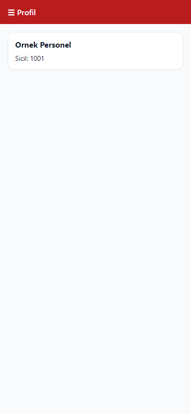
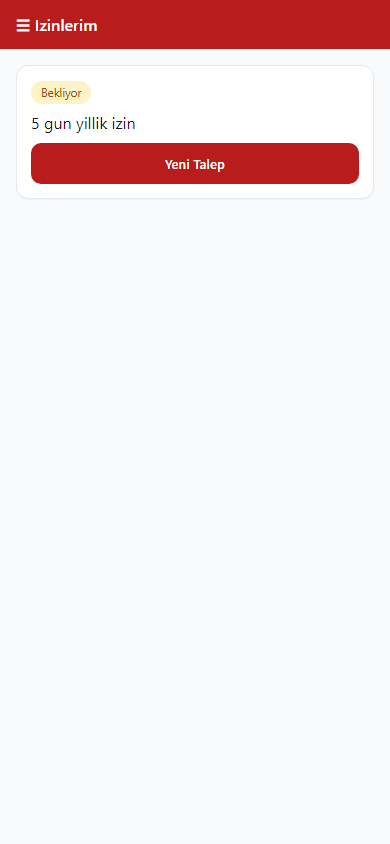
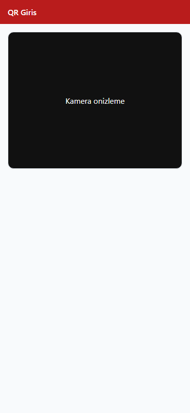

# 11. Personel portalı

[← Ana içindekiler](../Kullanici-Kilavuzu.md)

Sicil numarası tanımlı personelin **kendi bilgilerini** görüp talep oluşturduğu modüller. Ağırlıklı **Web** ve **Mobile**.

---

## 11.1 Web — Personel menüsü

Sol menü → **Personel** grubu *(sicil + yetki)*:

| Modül | İşlev |
|-------|--------|
| **Profil** | Kişisel bilgi, iletişim, fotoğraf |
| **İzinlerim** | Kendi izin talepleri ve geçmiş |
| **Avanslarım** | Avans talepleri |
| **Yetkili Paneli** | Amir ise ekibinin talepleri *(supervisor)* |

---

## 11.2 Profil

### Web

1. Personel → **Profil**.
2. Ad, sicil, departman, işe giriş vb. **salt okunur** veya düzenlenebilir alanlar (politikaya göre).
3. **Fotoğraf** güncelleme (varsa).
4. **Kaydet** — değiştirilebilir alanlar için.

### Mobile

1. Menü → **Profil** veya giriş sonrası yönlendirme.
2. Bilgileri kaydırarak görüntüleyin.
3. Düzenlenebilir alanları güncelleyip **Kaydet**.

---

## 11.3 İzinlerim

### Yeni talep (Web)

1. Personel → **İzinlerim** → **Yeni Talep**.
2. İzin türü seçin.
3. Başlangıç / bitiş tarihi.
4. Açıklama (isteğe bağlı).
5. **Gönder**.

### Yeni talep (Mobile)

1. Menü → **İzinlerim** → **+** veya **Yeni Talep**.
2. İzin türü, tarihler, açıklama.
3. **Gönder**.

### Talep durumu

| Durum | Anlam |
|-------|--------|
| Bekliyor | Amir/İK onayı bekleniyor |
| Onaylandı | İzin kaydı oluştu |
| Reddedildi | Red sebebi görüntülenir |

### Geçmiş izinler

Listedeki onaylanmış izinleri tarih ve tür ile görüntüleyin.

---

## 11.4 Avanslarım

### Web

1. Personel → **Avanslarım**.
2. **Yeni talep** → tutar, açıklama → **Gönder**.
3. Onay durumunu listeden takip edin.

### Mobile

1. Menü → **Avanslarım**.
2. **+** → tutar ve açıklama → **Gönder**.
3. Durumu kart listesinden izleyin.

---

## 11.5 Yetkili Paneli (amir)

1. Personel → **Yetkili Paneli** *(supervisor yetkisi)*.
2. Ekibinizin **bekleyen izin/avans** taleplerini görün.
3. **Onayla / Reddet** — [5. İzin ve avans talepleri](05-izin-avans-talepleri.md) ile aynı mantık, dar filtreli liste.

---

## 11.6 QR Giriş (Mobile)

1. Menü → **QR Giriş** *(personel menüsü)*.
2. Kamera izni verin.
3. Turnike veya Web'den üretilen **cihaz QR** kodunu okutun.
4. Başarılı okutma → giriş/çıkış hareketi kaydedilir.

---

## 11.7 WFA / WPF

Personel portalı modülleri masaüstünde **sınırlıdır**. Personel kendi talepleri için **Web** veya **Mobile** kullanmalıdır.

---

**Önceki:** [10. Sistem ayarları ←](10-sistem-ayarlari.md)  
**Sonraki:** [13. Canlı izleme →](13-canli-izleme.md)
